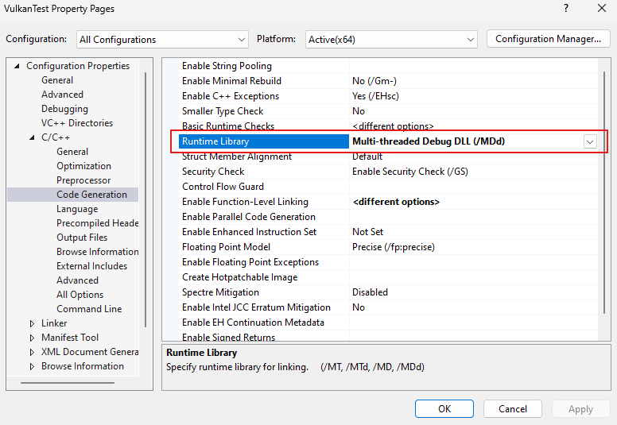

# Vulkan - First Project

### Errors and Warnings:

```
LINK : warning LNK4098: defaultlib 'MSVCRT' conflicts with use of other libs; use /NODEFAULTLIB:library
```
> **Fix**:
>
> Properties > C/C++ > Code Generation > Runtime Library > Set Runtime Library to: Multi-threaded DLL [1]
>
> [``` Set Runtime Library to: Multi-threaded DLL ```][1]
> 
> 


[1: https://stackoverflow.com/questions/18612072/link-warning-lnk4098-defaultlib-msvcrt-conflicts-with-use-of-other-libs-us][1]

[1]: https://stackoverflow.com/questions/18612072/link-warning-lnk4098-defaultlib-msvcrt-conflicts-with-use-of-other-libs-us
